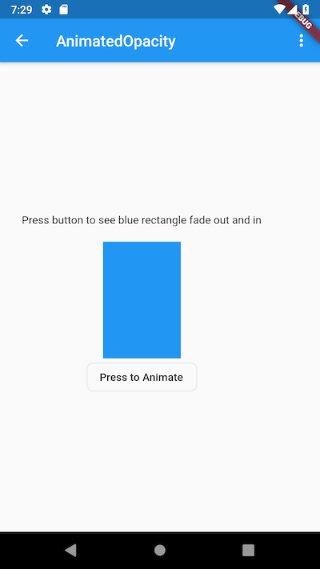

Title: Flutter code recipe for AnimatedOpacity widget
Date: 2018-1-30 11:33PM
Authors: ptyagi
Category: Development, Flutter, Cross-platform
Tags: AnimatedOpacity, flutter, code-recipes, android, android Studio, iOS
Summary: AnimatedOpacity widget is used to achieve a smooth transition from one UI element to another.

## AnimatedOpacity

AnimatedOpacity widget is used to achieve a smooth transition from one UI element to another.

***Recipe:*** Achieve a smooth animation when transitioning from one UI element to another.

***Focus Widget:*** AnimatedOpacity

***Goal:*** Fade in and out a blue rectangle on click of button. 
Interface is super simple and will look like this:



***[Checkout AnimatedOpacity animation](../../media/flutter/animatedOpacity/animated_opacity.webm)***

### Lets's go! ###

We need three things to accomplish our goal of animating a blue rectangle.
1. Widget to animate: A blue rectangle
```
    Container(
        width: 100,
        height: 150,
        color: Colors.blue,
    );
```
    
2. StatefulWidget: A way to hold visibility state of rectangle.
`StatefulWidget` has `State` object that can hold and update some data for app. 
`State` object's [`setState`](https://docs.flutter.io/flutter/widgets/State/setState.html) method helps to rebuild widget reflecting the updated state of the app data.

```
class _AnimatedOpacityRecipe extends StatefulWidget {
  @override
  State<StatefulWidget> createState() => _AnimatedOpacityRecipeState();
}
```

The State object will have the flag about the rectangle widget's visibility state say `_visible`.
`_visible` to `true` means that rectangle is visible or vice versa.
```
class _AnimatedOpacityRecipeState extends State<_AnimatedOpacityRecipe> {
  bool _visible = true;
  
} 
```
    
Method `animatedOpacityWidget` returns the AnimatedOpacity widget.
`duration` property is to control the speed of animation. 
In this example, it takes 900 milliseconds to fade out the rectangle.
This is important to show a smooth transition. 
```
Widget animatedOpacityWidget() {
    return AnimatedOpacity(
      duration: Duration(milliseconds: 900),
      opacity: _visible ? 1 : 0,
      child: _blueRectangle(),
    );
  }
```    
3. OutlineButton widget: A button to toggle fade in/out rectangle
Button labeled 'Animate' to fade in/out rectangle.
`setState()` method toggles the visibility flag for the rectangle widget.
It forces Flutter to rebuilt `AnimatedOpacity` widget in accordance with new value of `_visible` flag.
```
...
OutlineButton(
  shape: new RoundedRectangleBorder(
    borderRadius: new BorderRadius.circular(8.0),
  ),
  child: Text("Press to Animate"),
  onPressed: () {
    setState(() => _visible = !_visible);
  },
)
...
```

***Source code:*** Recipe source code is available [here](animated_opacity.dart)


### References: ###
1. https://flutter.io/docs/cookbook/animation/opacity-animation.html
2. https://docs.flutter.io/flutter/widgets/Opacity-class.html
