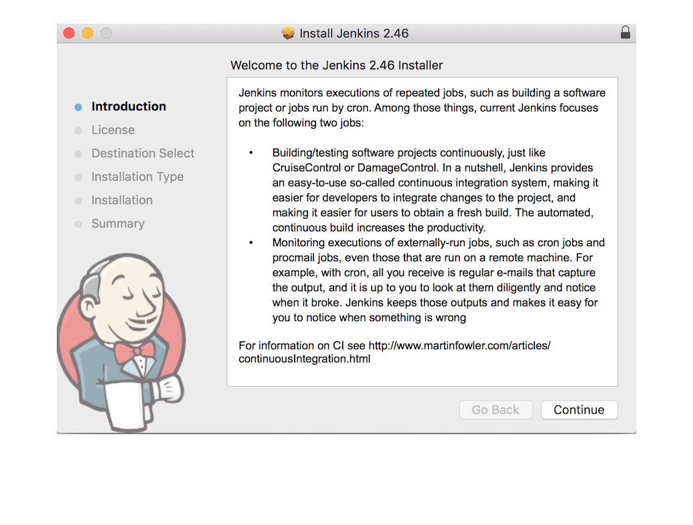
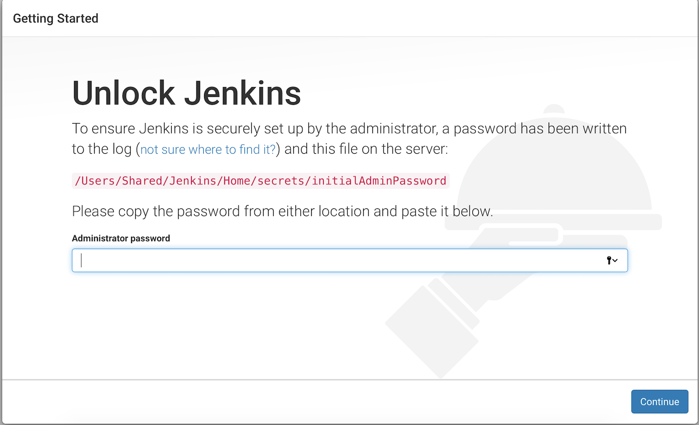
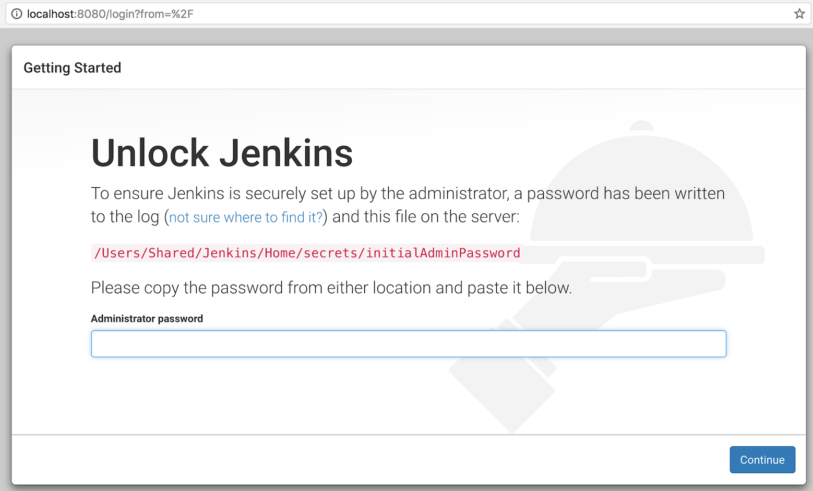
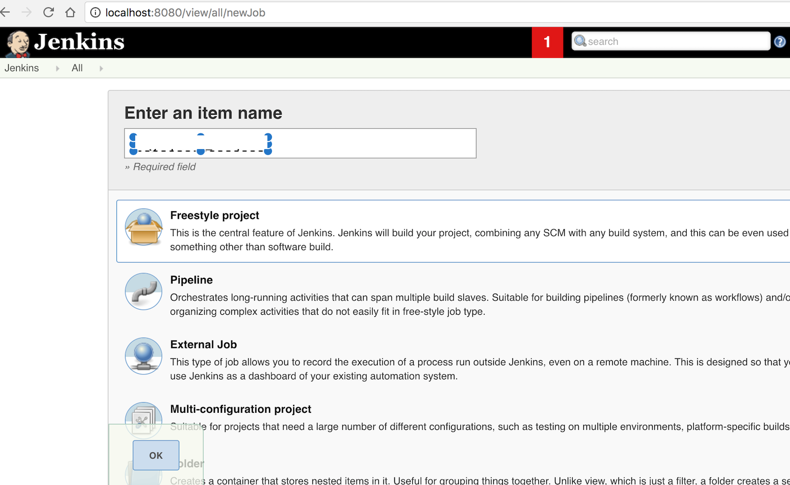
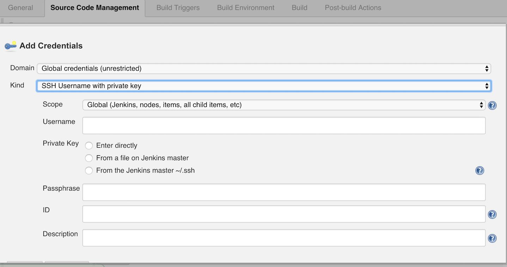
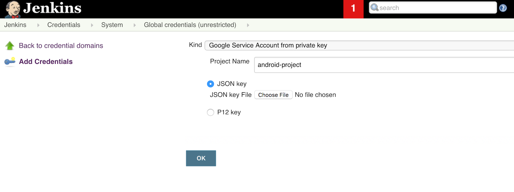
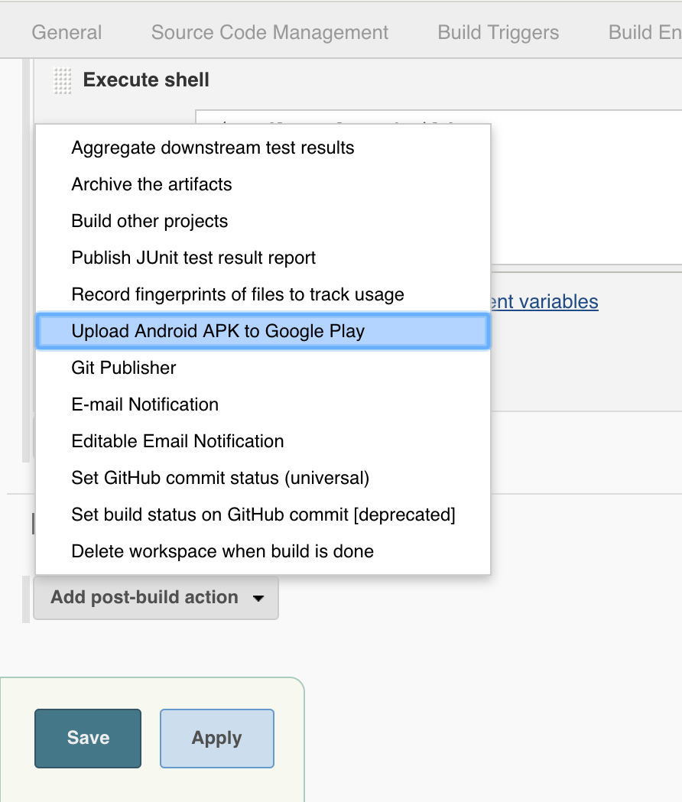
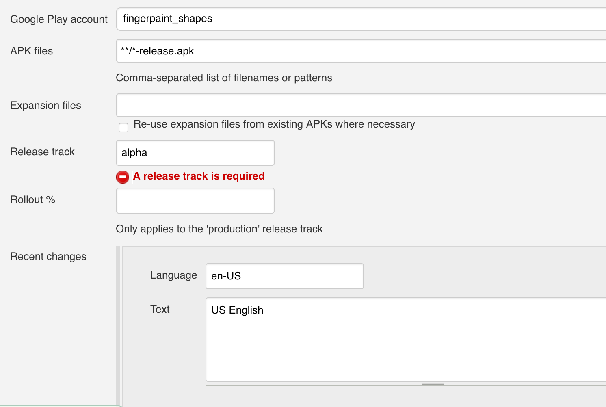

Title: Automating Android App publishing to Play Store  using Jenkins
Date: 2017-2-23 12:02PM
Authors: ptyagi
Category: Development
Tags: Android, Jenkins, DevOps
Summary: This post shows how to automate Android App publishing to Play Store using Jenkins on Mac OSX 10.12.3 and Jenkins 2.46.


### Introduction ###
This article describes the journey I took from setting up Jenkins to automate publishing Android APKs to Google Play Publishing portal and useful notes that I collected along the way. I set up Jenkins-2.46 on Mac OSX 10.12.3.

#### Download Package ####
You can download “.pkg” file from [here](http://mirrors.jenkins.io/osx/latest)

#### Complete Installation ####
Follow the instructions to complete installation.


**Note:** You’ll be asked to enter an additional password like below to ensure the security:
<br>


#### Choosing Plugins ####
You can go with default plugins unless you know what plugins you want to install. I'll cover other plugins, if needed as their need arises.

#### Starting Jenkins ####
Once installation is complete, you can type  [http://localhost:8080](http://localhost:8080) in your browser to start jenkins server. It’ll ask for temporary password it created at : /Users/Shared/Jenkins/Home/secrets/initialAdminPassword

This is how it will look like:


**Note:** Unless you’ve created an admin user explicitly, you can login as administrator using username **“admin”** and password created in **“/Users/Shared/Jenkins/Home/secrets/initialAdminPassword”** file.

Click on “Start Jenkins” to start creating jobs on Jenkins to automate project building and publishing.

### Setting up Job to Build Android project ###

#### **Create Jenkins Job** ####
1. Create a free-style project.


2. Add Repository in **Source Code Management** section. You will have to provide credentials to Jenkins to access source code repository.

3. Add build specific configuration in **Build** section. I'll be using shell script to build my gradle based project.

**Note:** If you're running into source code repo access issues, then you may want to add credentials like this:


#### **Uploading APK to Play Store** ####

**Setup**

1. You'll need [Google Play Android Publisher Plugin](https://wiki.jenkins-ci.org/display/JENKINS/Google+Play+Android+Publisher+Plugin) plugin to publish APKs automatically from Jenkins.

2. Navigate to localhost:8080 in your browser to get to Jenkins. Click on **Manage Jenkins** --> **Manage Plugins**. Look for 'Google Play Android Publisher Plugin' by typing it in search box and install. You'll need to add service account to Jenkins as well. Refer to [link for detailed process](https://wiki.jenkins-ci.org/display/JENKINS/Google+Play+Android+Publisher+Plugin)).

3. You'll need to enable API access from Jenkins. So, you have to be owner of your [Google Play Publisher account](https://developer.android.com/distribute/googleplay/start.html)

4. Its important to know that you must have pre-existing app in Play Store already before you could upload another incremental update via Jenkins.

5. Create Service account at Play Store publishing portal under 'API Access' category at left. It'll take you to Google project console. This is where, you'll create 'JSON' or 'p12' key to enable integration between Jenkins and Play Store publishing. Keep this key safe since you'll need this to enable Jenkins account to access Play store publishing. Also, Don't forget to grant 'Release Manager' permissions to this service account in Play store Publishing portal.

6. Go back to Jenkins, and create credentials to access Play Store. This is where you'll need to provide JSON key that you created in step above.


[Here](https://wiki.jenkins-ci.org/display/JENKINS/Google+Play+Android+Publisher+Plugin) is pretty good explanation of process to setup your accounts.

Note 1: You can use following command on terminal to reset `jenkins` user password, if run into password related issues:
```
sudo passwd jenkins
```

Note 2: Jenkins will need its own installation of Android sdk. Don't forget to make sure that sdk installation has `license` directory. If its not available, then copy it from you other sdk instaltion to here at first level. Check [this link](https://developer.android.com/studio/intro/update.html#download-with-gradle) for details.

**Configuring Job**
1. Add post-build action: "Upload Android APK to Google Play"


2. Fill-in the path or pattern to APK created locally. In my case, its `**/*-release.apk`. Also, add languages supprted and add roll-out percentage if its being pushed in production channel. I'm publishing to `alpha` channel.


And you're done !

For more details about configuring uploading job refer to [this link](https://wiki.jenkins-ci.org/display/JENKINS/Google+Play+Android+Publisher+Plugin).

Extra Credits:
[EnvInject Plugin](https://wiki.jenkins-ci.org/display/JENKINS/EnvInject+Plugin) can be used to supply APK signing password to Jenkins job. Checkout [this](https://stackoverflow.com/questions/27234506/android-build-release-apk-on-jenkins-without-storing-my-password-in-plain-text?answertab=votes#tab-top) StackOverflow answer on how to set it up.
