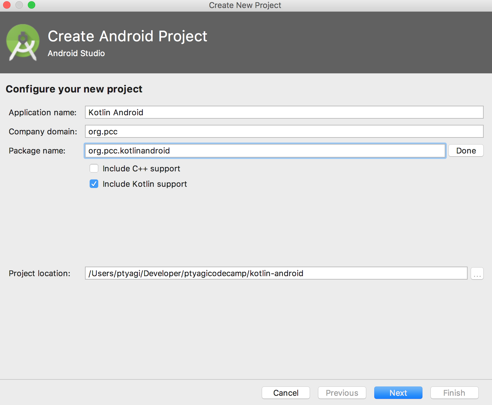
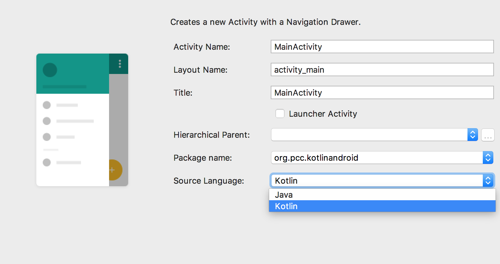
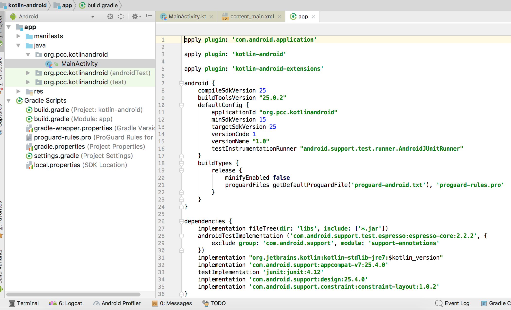
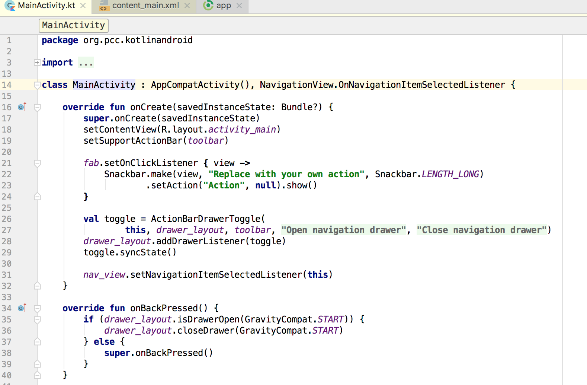
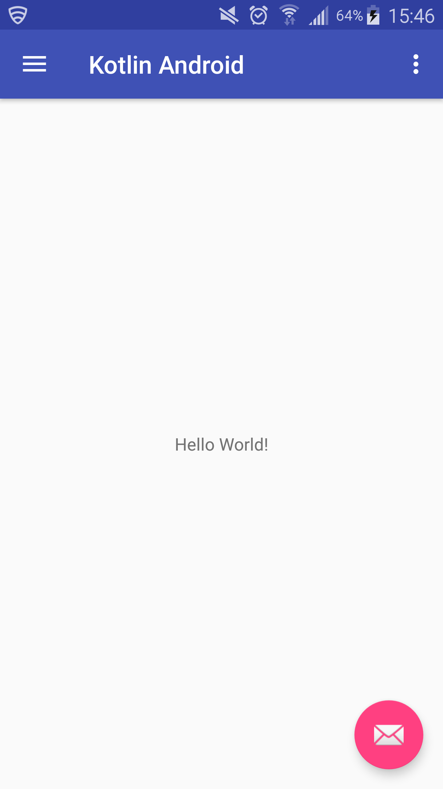

Title: Getting started with developing Android apps in Kotlin
Date: 2017-06-18 03:55PM
Authors: ptyagi
Category: Development
Tags: android, gradle, kotlin, android studio 3, dev
Summary: This post shows how to get started with creating Android apps in Kotlin language using Android Studio 3 and higher.

### Creating Kotlin Project in Android Studio (>=3) ###
In Android Studio 3 and higher, there's an option to select to create projects supporting Kolin. It's super simple to start writing your app from scratch in Kotlin. Here are screenshots to demo creating a Navigation Drawer based app in Kotlin:

***Creating New Project in Android Studio***
Don't forget to check Kotlin support checkbox.

***Choosing MainActivity***
I'm using Navigation Drawer activity as MainActivity for this sample app.

***build.gradle***
`build.gradle` will automatically add support for Kotlin language and other related plugins/libraries:

***MainActivity***
MainActivity will be generated in Kotlin automatically. This is how it would look like:

***Running First Kotlin App***
This is how running Kotlin sample on device would look like:

#### Facts about Kotlin ####
1. Kotlin's runtime library file size is about 859KB (as of version 1.1..2-5), which doesn't increase final APK size significantly.

2. There's no visual difference between Kotlin vs Java applications on Android platform, because Kotlin compiler produces byte-code.

Interested in checking out source code for this demo sample app ? Find it on [Github](https://github.com/ptyagicodecamp/kotlin-android)
***References:***
[Kotlin language's official site](http://kotlinlang.org/)
